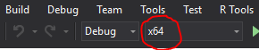
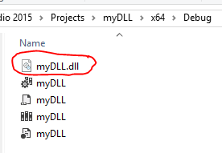

## Why would you want to use another language?
- R is great, but it has some weaknesses.
    - For example, loops can be slow.
- It is sometimes desirable to call code written in other languages from R.
- Also, you may want to call R from another language.
- R interfaces have been developed for a number of other languages
    - We will focus on C/C++.
- The main motivation in performance enhancement.
    - C/C++ code may run much faster than R.
    
## Writing C/C++ Functions to be called from R
- Key points to remember:
    - All the arguments passed from R to C/C++ are received by C/C++ as pointers
    - The C/C++ function itself must return `void`.
        - Hence, we need to pass a pointer for the result
    - For R to work with C++ code (or even C code compiled with g++), you need to wrap
your functions inside an an `extern` statement.
        - `extern "C" { your C++ code }`
        - Don't use `extern` for C code (it may be less efficient).
- We will learn to compile code using R (via gcc and g++) and Visual C++.
- The end product is a dynamic shared library file (.so) on Linux/OS X or a dynamic-link library (.dll) on Windows.

## Required software
- On windows, you need to install Rtools, available [here](https://cran.r-project.org/bin/windows/Rtools/)
    - Just choose the version that matches your computer architecture (i.e. 64 bit or 32 bit)
    - You have the make sure Rtools is in you path (may need to restart)
- Please verify:
    - On Linux you need to have GNU gcc and g++ (probably already installed)
        - Do you need r-base-dev?
    - On OS X, you may need Xcode.

## Our program: `timesTwo.cpp`
\Large
```{Rcpp, eval=FALSE}
extern "C" void
  timesTwo(double *in, double *out)
{
  double value = in[0] * 2.0;
	out[0] = value;
}
```

## What does `extern "C"` do?
- Remember R is written in C.
- `extern "C"` makes our C++ function available to a program written in C (i.e. R).
    - It declares the functions with C linkage.
    - If we write a C program (and use a C compiler), we don't need it.
- Note that the parameter and return types are constrained.
    - For example, cannot write a function that passes a (nontrivial) C++ class to a C program.
    - The C program would not know what to do about the constructors, destructors, and other class-specific operations.
    ```{Rcpp, eval=FALSE}
extern "C" void
  timesTwo(double *in, double *out)
{
  double value = in[0] * 2.0;
	out[0] = value;
}
```


## Compile using R's command line tools
- In R, you can type:
```{r}
system("R CMD SHLIB ./examples/timesTwo.cpp")
```
- Or, on the command line:

\centerline{
  \includegraphics[width=\textwidth,height=0.4\textheight,keepaspectratio]{./figures/RcmdSHLIB}
}

- Now we have timesTwo.dll (or timesTwo.so) ready to use in R

## Now run the DLL in R
```{r}
dyn.load("./examples/timesTwo.dll")
value_in <- 32; value_out <- 0
.C("timesTwo", as.double(value_in), 
   res=as.double(value_out))$res
dyn.unload("./examples/timesTwo.dll")
```
- `dyn.load` loads the .dll into R
- `.C` calls timesTwo, and passes `value_in` and `value_out` to the function.
    - `.C` returns a list, so we define 'result' and extract 'result' from the list.
- `dyn.unload` unloads the .dll from R (you need the unload the dll if you want to rebuild it).

## Wapper Functions
- For convenience, consider writing a wrapper function.
```{r}
dyn.load("./examples/timesTwo.dll")
timesTwoC <- function(val) {
  out <- 0
  .C("timesTwo", as.double(val), 
   res=as.double(out))$res
}
timesTwoC(32)
dyn.unload("./examples/timesTwo.dll")
```

## Using R's Library
- You can access C versions of many basic R functions, including `dnorm()`, `rnorm()`, etc.
- A nice reference is [here](http://www.biostat.jhsph.edu/~bcaffo/statcomp/files/cprog3_ho.pdf).
```{Rcpp, eval=FALSE}
/*randNorm.c*/
#include <R.h>
#include <Rmath.h>
void randNorm(double *out)
{
    GetRNGstate();
		out[0] = norm_rand();
		PutRNGstate();
}
```

## Running `randNorm` in R
```{r}
system("R CMD SHLIB ./examples/randNorm.c")
dyn.load("./examples/randNorm.dll")
n <- function() {out <- 0; .C("randNorm", out)[[1]]}
set.seed(2016)
c(n(), n(), n())
c(n(), n(), n())
set.seed(2016)
c(n(), n(), n())
dyn.unload("./examples/randNorm.dll")
```

## Using Vectors
```{Rcpp, eval=FALSE}
/*vec.c*/
void cumsum(double *x, int *n, double *res) {
  res[0] = x[0];
  for (int i = 1; i < *n; ++i) {
    res[i] = x[i] + res[i-1];
  }
}
```

## Running `cumsum` in R
```{r}
system("R CMD SHLIB ./examples/vec.c")
dyn.load("./examples/vec.dll")
n <- 3
out <- rep(0,n)
x <- 1:n
.C("cumsum", as.double(x), as.integer(n),
   cumsum = as.double(out))$cumsum
dyn.unload("./examples/vec.dll")
```


## Using C++11
```{Rcpp, eval=FALSE}
//file: randC11.cpp
#include <random>

extern "C" {
  void randNorm(int *seed, double *out)
  {
    std::mt19937 e(*seed);
    std::normal_distribution<double> N(0.0, 1.0);
    out[0] = N(e);
  }
}
```

## Using C++11: Set USE_CXX1X to some value
- The `USE_CXX1X` allows us to use the C++11 standard.
```{r}
Sys.setenv(USE_CXX1X = "NA")
system("R CMD SHLIB ./examples/randC11.cpp")
dyn.load("./examples/randC11.dll")
out <- 0
.C("randNorm", 9L, out)
dyn.unload("./examples/randC11.dll")
```
# Visual Studio

## Creating a DLL project in Visual Studio 2015
- Choose File/New/Project../Win32 Project

\centerline{
  \includegraphics[width=\textwidth,height=0.7\textheight,keepaspectratio]{./figures/project.png}
}


## Creating a DLL project in Visual Studio 2015
- Specify a DLL and an Empty project

\centerline{
  \includegraphics[width=\textwidth,height=0.7\textheight,keepaspectratio]{./figures/settings.png}
}

## Project at This Point

\centerline{
  \includegraphics[width=\textwidth,height=0.7\textheight,keepaspectratio]{./figures/projectToPoint}
}

## Add a C++ Source File
-Right-click Source Files in the Solution Explorer, then select Add New Item, and then select C++ File (.cpp)

\centerline{
  \includegraphics[width=\textwidth,height=0.7\textheight,keepaspectratio]{./figures/addNewItem}
}

## Add C++ Code to the Source File
- (this is actually C code)
\LARGE
```{Rcpp, eval=FALSE}
extern "C" void __cdecl 
  timesTwo(double *in, double *out)
{
  double value = in[0] * 2.0;
	out[0] = value;
}
```


## What is `__cdecl` about?
- Applies only to Windows.
- The Visual C++ compilers allow you to specify conventions for passing arguments and return values between functions and callers.
- Two options we care about:
    - **`__cdecl`** is used by C/C++ programs, R, Matlab, SAS, others.
    - **`__stdcall`** is used by Excel, Win32 API fuctions, Pascal, others.
- This all essentially amounts to conventions for who (function caller or function) pops arguments off the stack.
- For more information, see [this webpage](https://msdn.microsoft.com/en-us/library/984x0h58.aspx).
```{Rcpp, eval=FALSE}
extern "C" void __cdecl 
  timesTwo(double *in, double *out)
{
  double value = in[0] * 2.0;
  out[0] = value;
}
```

## Pointers
- For C++, `timesTwo(double& in, double& out)` works as well.
- We need to pass a pointer to store the result of the function.
```{Rcpp, eval=FALSE}
extern "C" void __cdecl 
  timesTwo(double *in, double *out)
{
  double value = in[0] * 2.0;
  out[0] = value;
}
```

## Add a Module Definition File (.def)
- Add New Item...Under Visual C++ / Code you will find the .def file.

\centerline{
  \includegraphics[width=\textwidth,height=0.7\textheight,keepaspectratio]{./figures/defFile.png}
}

## Module Definition File 
- A .def file is a module definition file. This is a convenient way to tell the linker which parts of our C++ code we want to export.

```{Rcpp, eval=FALSE}
// timesTwo.def
LIBRARY timesTwoDLL
EXPORTS
  timesTwo
```

- `LIBRARY` is the name of the DLL
- `EXPORTS` lists the functions to be exported (each one on a separate line)
    - If you want to use a different function name use `newName = oldName`
    
## Another option: `__declspec(dllexport)`
- Windows-specific.
- On Windows, we need to tell which functions are exported from the DLL.
    - That is, which functions will be available in R.
- we 
- When building your DLL, you typically create a header file that contains the functions you are exporting and add `__declspec(dllexport)` to the declarations in the header file.
- For more information, see [this.](https://msdn.microsoft.com/en-us/library/a90k134d.aspx)
- Instead of `__declspec(dllexport)`, you can use a [DEF file](https://msdn.microsoft.com/en-us/library/d91k01sh.aspx).
    
    
## Build the Solution
- Make sure to change the architecture to x64 before building (unless you are using 32bit R)

- Ctrl-Shift-B builds the solution.
- The DLL is found in the ./x64/Debug folder


## Add an R project to Visual Studio
- Right click the solution...Add...New Project...Other Languages...R project

\centerline{
  \includegraphics[width=\textwidth,height=0.7\textheight,keepaspectratio]{./figures/x64.PNG}
}

## Now run the DLL in R
- `dyn.load` loads the .dll into R
- `.C` calls timesTwo, and passes value_in and value_out to the function
    - `.C` returns a list, so we define 'result' and extract 'result' from the list
- `dyn.unload` loads the .dll into R
    - you need the unload the dll if you want to rebuild it.
    
\centerline{
  \includegraphics[width=\textwidth,height=0.8\textheight,keepaspectratio]{./figures/DLLinR.PNG}
}

## Let's change the code for Excel
- We don't need `extern "C"` anymore
- The function can return a double
- We need to use `__stdcall`
- Make sure the build matches the Excel version (x64 or x86)
- the .def file remains the same
```{Rcpp, eval=FALSE}
double __stdcall timesTwo(double *in)
{
	double value = in[0] * 2.0;
	return value;
}
```

## In Excel
- Alt-F11 opens the VBA editor window. Right click on workbook, Insert/Module
- We’ll add a declaration for the function in the DLL.

\centerline{
  \includegraphics[width=\textwidth,height=0.8\textheight,keepaspectratio]{./figures/vba.png}
}

- Now we can use the function in Excel

\centerline{
  \includegraphics[width=\textwidth,height=0.2\textheight,keepaspectratio]{./figures/inXL.png}
}

## Using R's Library
- Check out R-3.3.0\\include
    - In that folder there are several header files with functions we can use in C/C++
    - 

## Using R Inside C/C++ with Visual Studio
- On linux this is easy and well-documents
- On Windows, it's another story...
- I will show you how to do it on Windows,
- Once you know what to do, it is really easy

## Setting up the R API
- First you need `pexports` from MinGW.
    - We will use `pexports` to extract information from R.dll to create a list of symbols in the DLL
    - Then, we will use this file to generate an import library
- Go to MinGW.org to download the installer.  Then, install `pexports`.

\centerline{
  \includegraphics[width=\textwidth,height=0.5\textheight,keepaspectratio]{./figures/pexports.png}
}

## Setting up the R API
1. Create the exports definition file from R.dll 
- From the command prompt type
```
$ cd "C:\Program Files\Microsoft\MRO\R-3.3.0\bin\x64"
$ pexports R.dll > R.exp
```
    - Note if `C:\MinGW\bin` is not in your path, you will need to use the full path to pexports
    
2. Then create the library file using VC++ developer command prompt
```
$ lib /def:R.exp /out:Rdll.lib /MACHINE:X64
```
    - Now we can use this library in Visual Studio.
    
## Add the path to the R-Version\\include
- In Visual Studio, right-click the project to open up the property pages
- Add the path to the R header files

\centerline{
  \includegraphics[width=\textwidth,height=0.7\textheight,keepaspectratio]{./figures/inclDir.png}
}


## Add the Rdll.lib dependency
- Property pages/linker/all options
- Add Rdll.lib to the additional dependencies
- Add its path to the additional library Directories

\centerline{
  \includegraphics[width=\textwidth,height=0.7\textheight,keepaspectratio]{./figures/linkerOptions.png}
}

## R's random number generator in C++
```{Rcpp, eval=FALSE}
extern "C" void randNorm(double *out)
{
    GetRNGstate();
		out[0] = norm_rand();
		PutRNGstate();
}
```

## Using VS to Debug a dll for R (1)
- First, create a script in R to test your code:

\centerline{
  \includegraphics[width=\textwidth,height=0.7\textheight,keepaspectratio]{./figures/testScript.png}
}

## Using VS to Debug a dll for R (2)
- Next, enter the path to Rscript.exe and your script in the project's property pages. Click OK.
- Finally, press F5 to start the debugger.

\centerline{
  \includegraphics[width=\textwidth,height=0.7\textheight,keepaspectratio]{./figures/properyPages.png}
}

# Rcpp

## `Rcpp`
- Written by [Dirk Eddelbuettel](http://dirk.eddelbuettel.com/code/rcpp.html).
- I wanted to show you how build a DLL in Visual Studio, because it can be useful for more complicated projects
- Often it is easiest to use the Rcpp package instead.
- `Rcpp` makes it easy to pass vectors, matrices, lists, ect, back to R.
    - However, there is overhead in doing this.
    - If you are concerned about speed, consider using the simplest structure.
- Resources:
    - [Rcpp book](http://www.rcpp.org/book/) by Dirk Eddelbuettel. Can download it from [SpringerLink](https://link.springer.com/book/10.1007/978-1-4614-6868-4) on UCLA network.
    - [Advanced R](http://adv-r.had.co.nz/) by Hadley Wickham: [Rcpp](http://adv-r.had.co.nz/Rcpp.html) and [R’s C interface](http://adv-r.had.co.nz/C-interface.html) chapetrs.
    - [Rcpp Gallery](http://gallery.rcpp.org/): Articles and code examples for the `Rcpp` package.
    - [Writing R Extensions](https://cran.r-project.org/doc/manuals/r-release/R-exts.html) from CRAN.


## `Rcpp` Example
1. In RStudio, File / New File / C++ File.
2. Enter code in timesTwoRcpp.cpp
```{Rcpp, eval=FALSE}
#include <Rcpp.h>
// [[Rcpp::export]]
Rcpp::NumericVector timesTwo(Rcpp::NumericVector x) {
  return x * 2;
}
```
3. In R,
```{r, warning=FALSE}
library(Rcpp)
Rcpp::sourceCpp("./examples/timesTwoRcpp.cpp")
timesTwo(c(32,64))
```

## Loops are very slow in R
- One big difference between R and C++ is that the cost of loops is much lower in C++. 
- Let's compare 
```{r, message=FALSE,warning=FALSE}
sumR <- function(x) {
  total <- 0
  for (i in seq_along(x)) {
    total <- total + x[i]
  }
  total
}
```

## In C++ loops have very little overhead
  
```{r,message=FALSE,warning=FALSE}
library(Rcpp)
cppFunction('double sumC(NumericVector x) {
  int n = x.size();
  double total = 0;
  for(int i = 0; i < n; ++i) {
    total += x[i];
  }
  return total;
}')

```

## C++ vs. R
- The C++ version is similar, but:
    - To find the length of the vector, we use the `.size()` method, which returns an integer. C++ methods are called with `.` (i.e., a full stop).
    - The `for` statement has a different syntax: `for(init; check; increment)`. This loop is initialised by creating a new variable called `i` with
    value 0. Before each iteration we check that `i < n`, and terminate the loop if it's not. After each iteration, we increment the value of `i` by
    one, using the special prefix operator `++` which increases the value of `i` by 1.
    - **IN C++, VECTOR INDICES START AT 0!** This is a very common source of bugs when converting R functions to C++.
    - Use `=` for assignment, not `<-`.
    - C++ provides operators that modify in-place: `total += x[i]` is equivalent to `total = total + x[i]`. Similar in-place operators are `-=`, `*=`,
    and `/=`.

## Bechmarking
- In this example C++ is much more efficient than R:
    - `sumC()` is competitive with the highly optimized built-in `sum()`,
    - `sumR()` is several orders of magnitude slower.

```{r,message=FALSE,warning=FALSE}
library(microbenchmark)
x <- runif(2000)
microbenchmark(sum(x), sumC(x), sumR(x))
```

<!-- ## Resources -->
<!-- http://adv-r.had.co.nz/C-interface.html -->

<!-- https://cran.r-project.org/doc/manuals/r-release/R-exts.html -->

## Lab 4
\begin{center}
\Large Let's work on Lab 4.
\end{center}